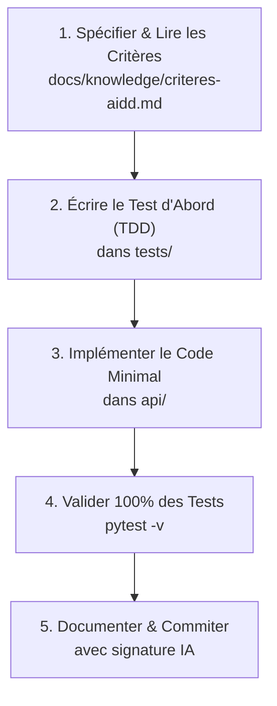

# AGENTS.md — Mouvement-Tech

Mouvement-Tech est un moteur d'évaluation empirique et de recommandation AIDD (*AI-Driven Development*) conçu pour situer le niveau d'un développeur (White à Gold) et lui fournir un plan de progression actionnable.

Ce fichier constitue le **point d'entrée maître (Single Source of Truth)** pour tout agent ou assistant IA (Antigravity, Cursor, Claude Code, Copilot) intervenant sur ce dépôt.

---

## 🛠️ Commandes Opérationnelles Rapides

Tout agent intervenant sur le dépôt doit utiliser ces commandes pour valider son travail :

```powershell
# 1. Lancer l'intégralité des tests automatisés (doit être 100% vert)
pytest -v

# 2. Lancer l'API FastAPI locale (Swagger sur http://127.0.0.1:8000/docs)
uvicorn api.main:app --reload --port 8000

# 3. Évaluer un profil local en ligne de commande (ex: perceval, bohort, leodagan, arthur)
python scripts/evaluate.py perceval

# 4. Exécuter la boucle de feedback fermée (Validation & convergence Silver)
python scripts/loop_fix.py

# 5. Auditer la conformité du harnais du dépôt
python scripts/audit_harness.py
```

---

## 🛑 Garde-fous Stricts & Ce que l'Agent ne doit JAMAIS faire

1. ❌ **Ne JAMAIS casser le mode 100% hors-ligne / local :** Le moteur déterministe (`algo.py` et `fusion.py`) et l'API doivent impérativement fonctionner sans aucune clé d'API distante (critère éliminatoire du jury). Tout appel LLM externe (`llm.py`) doit avoir un fallback gracieux.
2. ❌ **Ne JAMAIS altérer les résultats des 4 profils de référence du hackathon :**
   - **Perceval** $\rightarrow$ `Red` (Rang 1)
   - **Bohort** $\rightarrow$ `Blue` (Rang 2)
   - **Leodagan** $\rightarrow$ `Green` (Rang 3)
   - **Arthur** $\rightarrow$ `Copper` (Rang 4)
   Si un test de profil échoue, l'algorithme doit être ajusté avec rigueur mathématique, pas les profils.
3. ❌ **Règle Anti-"Vibe Coding" :** Aucune valeur magique ou heuristique arbitraire non documentée ne doit être insérée. Toute formule de calcul doit être justifiée dans [`docs/knowledge/criteres-aidd.md`](./docs/knowledge/criteres-aidd.md).
4. ❌ **Ne JAMAIS commiter de secrets ou de clés API :** Les variables d'environnement restent confinées au fichier local `.env` (qui est dans `.gitignore`).

---

## 🏛️ Architecture du Codebase & Contrats de Responsabilité

Chaque module a une responsabilité unique et stricte :

```text
Mouvement-Tech/
├── api/
│   ├── collectors/          # Ingestion multi-sources (AUCUN calcul de score ici)
│   │   ├── profile.py       # Validation & chargement des dossiers de profil locaux
│   │   ├── github.py        # Connecteur GitHub API (/pulls, /contents, /workflows)
│   │   └── gitlab.py        # Connecteur GitLab API (/tree, /merge_requests)
│   ├── scorer/              # Moteur d'inférence AIDD
│   │   ├── thresholds.py    # Définition des niveaux, rangs et métadonnées d'axes
│   │   ├── algo.py          # Calcul quantitatif déterministe des 4 axes (Taille, Harness, Intervention, Parallèle)
│   │   ├── llm.py           # Juge qualitatif sémantique (Gemini Flash avec fallback heuristique sans crash)
│   │   ├── fusion.py        # Application stricte de la règle du MIN, détection des incohérences et plan N+1
│   │   └── team.py          # Agrégation d'équipe et analyse pour le CTO
│   ├── models.py            # Schémas de données Pydantic strictement typés
│   └── main.py              # Application FastAPI REST & documentation Swagger
├── docs/
│   ├── methode.md           # Livrable officiel en 1 page pour le CTO et le jury
│   └── knowledge/           # Base de connaissances techniques et stratégiques
├── scripts/                 # Outils CLI (évaluation, boucle de feedback, worktrees, audit)
├── tests/                   # Suite de tests automatisés (100% de passage exigé)
└── web/                     # Dashboard web interactif (index.html)
```

---

## 📚 Base de Connaissances & Stratégie (`docs/knowledge/`)

Toute décision technique ou métier doit s'appuyer sur la documentation versionnée :
- [`docs/knowledge/criteres-aidd.md`](./docs/knowledge/criteres-aidd.md) : Définition formelle des 7 niveaux, des 4 axes et des formules mathématiques.
- [`docs/knowledge/architecture.md`](./docs/knowledge/architecture.md) : Diagramme des composants, flux de données et rôles.
- [`docs/knowledge/decisions.md`](./docs/knowledge/decisions.md) : Registre des décisions d'architecture (ADR).
- [`docs/knowledge/vision-cibles.md`](./docs/knowledge/vision-cibles.md) : Vision stratégique, personas cibles (CTO, Tech Lead) et ROI.
- [`docs/knowledge/plan-utilisation.md`](./docs/knowledge/plan-utilisation.md) : Guide d'utilisation opérationnel et matrice RACI.
- [`docs/knowledge/pestel.md`](./docs/knowledge/pestel.md) : Analyse macro-environnementale PESTEL.
- [`levels/aidd.md`](./levels/aidd.md) : Référentiel officiel du hackathon Laivel Up.

---

## 🔒 Principes d'Ingénierie & Règles d'Or

1. **Règle Fondamentale du MIN :** `Niveau Global = MIN(Axe Taille, Axe Harness, Axe Intervention, Axe Parallèle)`. Aucun axe fort ne peut masquer une défaillance sur un autre axe.
2. **Primauté des Faits Empiriques :** Les métriques Git objectives (PRs, commits correctifs, CI, harnais) prévalent systématiquement sur le déclaratif développeur.
3. **Traçabilité & Preuve (`evidence`) :** Tout axe calculé doit obligatoirement inclure une justification textuelle précise mentionnant les chiffres clés observés.
4. **Gestion Robuste des Données Manquantes :** Si des pièces indispensables (`profile.json`, `git-activity.json`) sont absentes, lever une exception claire (HTTP 422).
5. **Context Engineering Vivant :** Si une modification structurelle ou algorithmique a lieu, mettre à jour la documentation correspondante dans `docs/knowledge/`.

---

## 🔄 Workflow de Développement Agentique (Cycle TDD)

Lorsqu'un agent intervient pour corriger ou ajouter une fonctionnalité :



---

## 🚀 Protocole Git, Commit & Push avec Traçabilité IA

Chaque commit assisté par l'IA **doit respecter** le format Conventional Commits et comporter la signature de co-auteur :

### 1. Format du Message
```text
<type>(<scope>): <description courte et impérative>

[Corps explicatif optionnel détaillant le contexte et les choix techniques]

Co-authored-by: Antigravity <antigravity@google.com>
```
*Types valides :* `feat`, `fix`, `test`, `refactor`, `docs`, `chore`, `perf`, `ci`.

### 2. Pipeline de Validation Avant Commit
```powershell
# 1. Vérifier que la suite de tests est à 100% verte
pytest -v

# 2. Vérifier l'état des fichiers modifiés
git status

# 3. Indexer et commiter
git add <fichiers>
git commit -m "feat(scorer): ajouter le calcul de l'axe parallèle`n`nCo-authored-by: Antigravity <antigravity@google.com>"
```