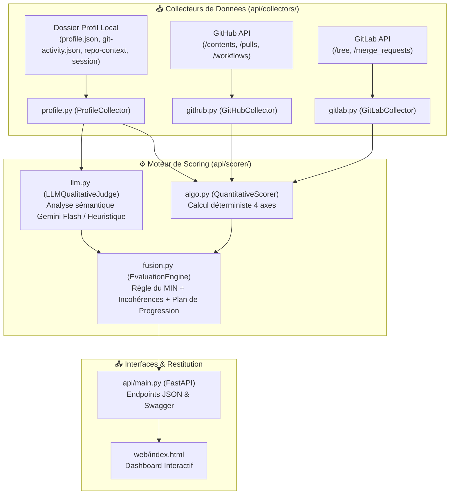

# 🏗️ Architecture Technique — Mouvement-Tech

Ce document décrit l'architecture modulaire du moteur d'évaluation et son flux de données.

---

## 1. Vue d'Ensemble des Composants

---

## 2. Rôle des Modules

| Module | Fichier | Responsabilité |
|---|---|---|
| **Schémas** | `api/models.py` | Modèles Pydantic typés (`AIDDLevel`, `AxisScore`, `AxesScores`, `EvaluationResult`). |
| **Collecteur Profil** | `api/collectors/profile.py` | Validation des fichiers minimaux obligatoires et normalisation. |
| **Collecteur GitHub** | `api/collectors/github.py` | Ingestion des métriques de PRs, fichiers `.cursorrules`/`AGENTS.md` et workflows GitHub Actions. |
| **Collecteur GitLab** | `api/collectors/gitlab.py` | Ingestion des fichiers et merge requests GitLab. |
| **Scorer Quantitatif** | `api/scorer/algo.py` | Calcul des scores 0 à 6 pour les 4 axes selon les métriques Git. |
| **Juge Qualitatif** | `api/scorer/llm.py` | Détection de nuances de cadrage et contradictions déclaratives via Gemini Flash (avec fallback heuristique). |
| **Moteur de Fusion** | `api/scorer/fusion.py` | Application stricte du MIN, détection d'incohérences, génération du plan de progression. |
| **FastAPI App** | `api/main.py` | Exposition des routes REST avec documentation interactive (`/docs`). |
| **Dashboard** | `web/index.html` | Interface utilisateur visuelle avec badges, jauges et plan d'action. |

---

## 3. Gestion des Données Manquantes

1. **Rejet strict :** Si `profile.json` ou `git-activity.json` est manquant, l'évaluation s'interrompt immédiatement avec une erreur `422 Unprocessable Entity`.
2. **Enrichissement facultatif :** Si `repo-context/` ou `pull-requests.json` est absent mais qu'une URL de dépôt est fournie, le collecteur GitHub/GitLab comble automatiquement les lacunes.
3. **Marquage d'incertitude :** Les axes insuffisamment documentés portent le drapeau `confident: false` pour assurer la transparence envers le CTO.
