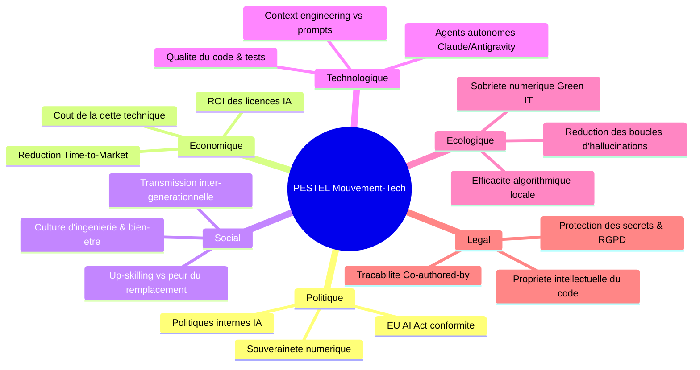

# 🌍 Analyse Stratégique PESTEL — Mouvement-Tech

Ce document évalue l'impact macro-environnemental du déploiement de l'AI-Driven Development (AIDD) et le positionnement stratégique de **Mouvement-Tech**.

---

---

## 1. 🏛️ Facteurs Politiques (P)

- **Souveraineté Numérique & Régulation :** L'Union Européenne encadre fermement l'intelligence artificielle via l'**EU AI Act**. Les entreprises doivent être capables d'auditer et d'expliquer comment et où l'IA intervient dans la création logicielle.
- **Politiques Nationales d'Innovation :** Les gouvernements soutiennent la transformation technologique des entreprises, exigeant des indicateurs d'efficacité clairs pour justifier les crédits d'impôt recherche (CIR/CII) ou subventions d'innovation.
- **Gouvernance Interne :** Besoin de règles transparentes au sein des organisations pour éviter l'usage de "Shadow AI" (développeurs utilisant des LLMs non autorisés sans contrôle).

---

## 2. 💶 Facteurs Économiques (E)

- **Rationalisation du coût des licences IA :** Les licences Cursor, GitHub Copilot ou Claude Enterprise représentent un coût récurrent significatif ($20$ à $50\$/\text{dev}/\text{mois}$). Mouvement-Tech permet de vérifier si ces outils sont réellement rentabilisés ou sous-utilisés (profils bloqués en *Red*).
- **Accélération du Time-to-Market :** Passer du niveau *Red* au niveau *Green/Copper* permet de multiplier par 3 la vélocité de livraison de fonctionnalités complexes ($L$ et $XL$) sans recruter de manière disproportionnée.
- **Maîtrise du coût de la dette technique :** Mesurer et limiter les commits correctifs post-ouverture (Axe 3) évite d'accumuler une dette invisible qui coûte des millions en maintenance corrective.

---

## 3. 👥 Facteurs Sociaux & Culturels (S)

- **Apaisement des craintes de remplacement :** L'évaluation par paliers AIDD démontre que l'IA valorise l'ingénieur en le transformant en **concepteur/cadreur** (niveaux *Blue/Green/Copper*), éliminant les tâches de copier-coller rébarbatives.
- **Culture d'Ingénierie & Tutorat :** La matrice d'équipe favorise l'émulation collective et le pair-programming entre profils expérimentés (Arthur, Leodagan) et débutants (Perceval).
- **Attractivité & Rétention des Talents :** Les meilleurs ingénieurs cherchent des entreprises modernes dotées de harnais matures et de processus d'IA structurés plutôt que d'un outillage artisanal.

---

## 4. 🔬 Facteurs Technologiques (T)

- **Révolution des Agents & Worktrees :** Transition rapide du simple "autocomplete" (Red) vers les agents autonomes multi-fichiers fonctionnant en arrière-plan avec isolation par Git worktrees (Copper/Silver).
- **Context Engineering comme nouveau standard :** La mémoire projet (`AGENTS.md`, `.cursorrules`, `.claude/skills`) devient un composant architectural aussi fondamental que la base de données ou le routeur API.
- **Convergence vers les boucles fermées :** Émergence de mécanismes où la CI et les linters fournissent un feedback automatique au modèle pour auto-corriger le code sans intervention humaine (Palier Silver).

---

## 5. 🌱 Facteurs Écologiques & Green IT (E)

- **Sobriété Numérique & Économie d'Énergie :** Un développeur de niveau *Red* qui itère 15 fois avec des prompts vagues consomme jusqu'à **$10\times$ plus de tokens et d'énergie** qu'un développeur de niveau *Green* dont le harnais cadre la génération du premier coup.
- **Moteur d'évaluation local et léger :** Mouvement-Tech privilégie un calcul déterministe ultra-rapide en Python pur ($<0.3\text{s}$) avec fallback zéro-token, minimisant son empreinte carbone par rapport aux plateformes tout-LLM énergivores.
- **Élimination du code mort :** Des PRs mieux ciblées réduisent l'enflure du codebase (*code bloat*) et l'énergie nécessaire aux compilations et déploiements continus.

---

## 6. ⚖️ Facteurs Légaux & Conformité (L)

- **Propriété Intellectuelle & Droits d'Auteur :** La justice et les régulateurs exigent de plus en plus de distinguer le code écrit par l'humain de celui généré par l'IA.
- **Traçabilité Obligatoire `Co-authored-by` :** Mouvement-Tech impose et audite la signature légale des commits pour garantir une traçabilité irréfutable dans l'historique Git.
- **Protection des Secrets & RGPD :** L'évaluation garantit que le harnais exclut formellement les fichiers sensibles (`.env`, credentials, données personnelles) des contextes transmis aux modèles.
