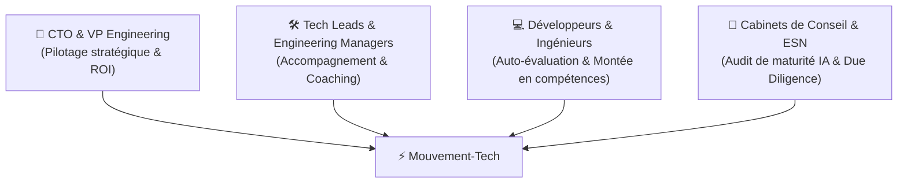

# 🎯 Vision, Cibles & Proposition de Valeur — Mouvement-Tech

> **Problématique :** Aujourd'hui, 80% des entreprises paient des licences d'outils IA (GitHub Copilot, Cursor, Claude Code) sans être capables de mesurer l'impact réel, ni de savoir pourquoi certains développeurs restent bloqués à un usage superficiel.

---

## 1. Pour qui ce projet est-il conçu ? (Personas Cibles)

### 👔 Persona 1 : Le CTO / VP of Engineering *(Cible Principale)*
- **Son défi :** *"La direction générale me demande le ROI de nos investissements IA. Je dois savoir quel est le niveau d'adoption de toute mon équipe pour vendredi et établir un plan de formation budgété."*
- **Ce que Mouvement-Tech lui apporte :**
  - Score global de maturité de l'équipe (0 à 6).
  - Détection automatique du **goulot d'étranglement collectif** (est-ce le harnais ? la taille des chantiers ? les reprises manuelles ?).
  - Plan d'action managérial prêt à présenter au comité de direction.

### 🛠️ Persona 2 : Le Tech Lead / Engineering Manager
- **Son défi :** *"Certains développeurs font du copier-coller dans ChatGPT et génèrent des PRs pleines de régressions, pendant que d'autres mènent 3 chantiers en parallèle. Comment harmoniser les pratiques ?"*
- **Ce que Mouvement-Tech lui apporte :**
  - Matrice des compétences de l'équipe basée sur les faits Git (zéro biais déclaratif).
  - Identification des binômes de tutorat (ex: Arthur/Leodagan en coaching de Perceval).
  - Règles concrètes à standardiser (`AGENTS.md`, conventions de spec review).

### 💻 Persona 3 : Le Développeur Individuel
- **Son défi :** *"J'utilise l'IA tous les jours, mais j'ai l'impression de plafonner ou de passer mon temps à corriger le code produit. Comment passer au niveau supérieur ?"*
- **Ce que Mouvement-Tech lui apporte :**
  - Diagnostic factuel de ses 4 axes (Taille, Harnais, Intervention, Parallèle).
  - Identification précise de son axe limitant.
  - Plan de progression personnalisé $N+1$ avec 3 actions prioritaires immédiates.

### 🏢 Persona 4 : Les ESN & Cabinets d'Audit / M&A
- **Son défi :** *"Auditer la 'Tech Stack & AI-Readiness' d'une startup lors d'un rachat ou pour un grand compte."*
- **Ce que Mouvement-Tech lui apporte :**
  - Audit instantané d'un dépôt public/privé via l'API.
  - Mesure du ratio de co-authorship IA et de la maturité des harnais de contexte.

---

## 2. Proposition de Valeur Unique (UVP)

| Approche Classique (Questionnaires / Déclaratif) | Approche Mouvement-Tech (Empirique & Normée) |
|---|---|
| ❌ Déclaratif trompeur (Perceval se croit "avancé"). | ✅ **Vérité empirique par l'activité Git, PRs et CI.** |
| ❌ Mesure uniquement le volume de tokens dépensés. | ✅ **Mesure la maturité du workflow (4 axes AIDD).** |
| ❌ Rapport générique non actionnable ("Formez-vous à l'IA"). | ✅ **Principe du MIN : ciblage chirurgical de l'axe bloquant.** |
| ❌ Outils fermés sans traçabilité. | ✅ **Traçabilité native `Co-authored-by` & conformité.** |

---

## 3. Vision Long-Terme & But Final

Mouvement-Tech ambitionne de devenir le **"Swarmia / LinearB & SonarQube de l'AI-Driven Development"** :
1. **Engineering Intelligence pour CTOs :** Fournir une visibilité objective en temps réel sur la maturité IA et la qualité des pratiques, connectable à Jira, GitHub et GitLab.
2. **Intégration continue (CI/CD Quality Gate) :** Bloquer la dégradation des pratiques et vérifier la présence de harnais à chaque commit.
3. **Coaching Adaptatif :** Guider chaque développeur sans paternalisme, via des recommandations empiriques issues de l'analyse de son code.
4. **Standard Industriel :** Établir une métrique standard d'audit pour les levées de fonds, acquisitions (M&A) et recrutements techniques.
2. **Benchmarking sectoriel anonymisé :** Permettre aux entreprises de comparer leur maturité IA par rapport aux standards de l'industrie.
3. **Passerelle vers les Agents Autonomes :** Préparer les équipes à l'orchestration des paliers Silver (boucles de validation) et Gold (spécification autonome).
