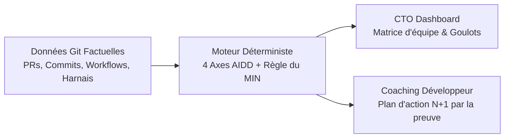

# 📄 Notre Méthode en 1 Page — Mouvement-Tech
> **Plateforme d'Engineering Intelligence & Gouvernance AIDD (*AI-Driven Development*)**

---

## 🎯 1. La Problématique & Le Piège du "Vibe Coding"

Face à la demande d'un CTO (*« Il me faut le niveau AIDD de toute l'équipe et un plan de progression pour vendredi »*), deux écueils majeurs guettent le management technique :
1. **L'illusion du déclaratif :** Se fier aux questionnaires d'auto-évaluation où chaque développeur se prétend "expert IA".
2. **Le piège du "Vibe Coding" naïf :** Récompenser la génération aveugle de code par l'IA au détriment de l'architecture, ce qui génère une dette technique et des reprises massives.

**Notre conviction :** Mouvement-Tech agit comme le **Swarmia / DORA de l'AI-Driven Development**. L'efficacité d'un ingénieur avec l'IA ne se mesure pas au nombre de prompts envoyés, mais à la **robustesse de son harnais**, à son **autonomie de boucle fermée (zéro reprise humaine)** et à sa **capacité de parallélisation d'environnements**.

---

## 📊 2. Ce que nous mesurons (Les 4 Axes Empiriques)

Nous ingérons les données brutes objectives pour situer le profil sur les 4 axes fondamentaux du référentiel AIDD :

| Axe | Métrique empirique extraite | Ce qu'elle garantit (Génie Logiciel) |
|---|---|---|
| **1. Taille** | Distribution des tailles de PR (`xs`, `s`, `m`, `l`, `xl`), médiane de lignes modifiées. | Mesure la granularité habituelle déléguée à l'IA (du simple snippet S au module complet XL). |
| **2. Harness** | Détection de fichiers structurés (`AGENTS.md`, `CLAUDE.md`, `.cursorrules`, skills, boucles CI). | **Le cœur de la maturité :** Passage de l'*IA sans mémoire* (One-shot) au *Context Engineering* (Blue/Green), puis aux *Boucles d'auto-correction fermées* (Silver). |
| **3. Intervention** | Nombre médian de commits correctifs post-ouverture de PR, ratio de PR sans edit. | Évalue l'efficacité du cadrage en amont : moins il y a de reprises après coup, plus l'IA a été guidée avec rigueur (anti-vibe coding). |
| **4. En Parallèle** | Médiane des branches concurrentes actives et menées jusqu'au merge. | Mesure la maîtrise des environnements isolés (`git worktrees`, multi-sessions) pour démultiplier la vélocité. |

---

## ⚖️ 3. La Règle du Minimum Strict (MIN) & Détection des Biais

$$\text{Niveau Global} = \min(\text{Axe Taille}, \text{Axe Harness}, \text{Axe Intervention}, \text{Axe Parallèle})$$

1. **Aucune moyenne pondérée permissive :** Un développeur produisant des modules XL mais sans aucun harnais et avec 4 commits correctifs par PR reste bloqué à **Red** (cas d'école *Perceval*). Le maillon le plus faible dicte le niveau réel pour prévenir la dette technique.
2. **Primauté absolue des faits Git :** Notre moteur compare ce que le développeur affirme et ce que Git prouve. Les divergences sont signalées au CTO sous forme d'alertes de cadrage (*warnings*).

---

## 🚀 4. Plan de Progression Actionnable (+1) & Vue Équipe

L'outil ne se contente pas d'attribuer un rang : il identifie le **Goulot d'Étranglement (Axe Limitant)** et prescrit les actions chirurgicales pour atteindre le niveau supérieur :
* **Vers Blue :** Structurer le *Context Engineering* (mémoire d'architecture et conventions dans un `AGENTS.md`).
* **Vers Green :** Cadrer les tâches en amont (spécifications préalables, tests d'abord) et versionner des règles comportementales.
* **Vers Copper :** Systématiser le travail parallèle (isolation par `git worktrees`, multi-agents).
* **Vers Silver/Gold :** Fermer la boucle avec l'auto-correction (*Feedback Loops* CI/CD relançant l'agent sur échec de test).

---

## 🛠️ 5. Robustesse, Autonomie & Intégration

* **100% Autonome & Local :** Moteur déterministe en Python pur, fonctionnant sans aucune clé d'API distante pour le jury.
* **Hybridation LLM :** Enrichissement sémantique optionnel via Gemini Flash pour qualifier les sessions et déclaratifs.
* **Intégration Managériale :** API REST (`/evaluate`, `/team`), CLI rapide et Dashboard Web interactif (CTO & Dev).